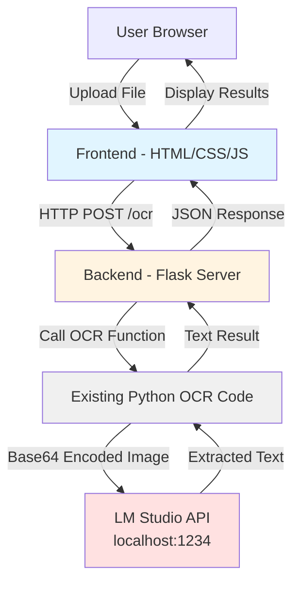

# Design Document: OCR Web UI

## Overview

The OCR Web UI is a web-based application that provides a simple interface for performing Optical Character Recognition on images and PDF files using a locally hosted LightOnOCR-2-1B model via LM Studio. The system consists of:

- **Frontend**: A single-page web interface built with HTML, CSS, and JavaScript
- **Backend**: A Python web server (Flask) that wraps the existing LM Studio API integration
- **Integration Layer**: The existing Python code that communicates with LM Studio at http://localhost:1234

The architecture follows a client-server model where the frontend handles user interactions and display, while the backend manages file processing and API communication with the LM Studio OCR model.

## Architecture



### Architecture Decisions

1. **Flask for Backend**: Flask is lightweight, easy to integrate with existing Python code, and provides simple routing for the single OCR endpoint needed.

2. **Single-Page Application**: All functionality on one page reduces complexity and provides immediate feedback to users without page navigation.

3. **REST API Design**: A single `/ocr` endpoint accepts file uploads and returns JSON responses with extracted text or error messages.

4. **Reuse Existing Code**: The current Python implementation for LM Studio communication will be wrapped by Flask endpoints rather than rewritten.

## Components and Interfaces

### Frontend Components

#### 1. File Upload Component
- **Purpose**: Handle file selection and validation
- **Elements**:
  - File input element (accepts .png, .jpg, .jpeg, .pdf)
  - Upload button or drag-and-drop zone
  - File type validation logic
- **Behavior**:
  - Validates file type on selection
  - Triggers preview update on valid file
  - Shows error message for invalid files

#### 2. Preview Component
- **Purpose**: Display uploaded file before processing
- **Elements**:
  - Image display area for image files
  - PDF preview (first page) for PDF files
  - Placeholder for empty state
- **Behavior**:
  - For images: Display using `` tag with data URL
  - For PDFs: Use PDF.js library to render first page
  - Clear previous preview when new file uploaded

#### 3. Process Button Component
- **Purpose**: Trigger OCR processing
- **Elements**:
  - Button element
  - Loading spinner/indicator
- **Behavior**:
  - Disabled when no file uploaded
  - Shows loading state during processing
  - Triggers API call to backend

#### 4. Results Display Component
- **Purpose**: Show extracted text and provide copy functionality
- **Elements**:
  - Text area or pre-formatted text display
  - Copy to clipboard button
  - Empty state placeholder
- **Behavior**:
  - Displays extracted text with preserved formatting
  - Enables copy button when results present
  - Clears when new file uploaded

#### 5. Status/Error Component
- **Purpose**: Provide user feedback on operations
- **Elements**:
  - Status message area
  - Error message display
  - Loading indicator
- **Behavior**:
  - Shows loading during OCR processing
  - Displays success message on completion
  - Shows error details on failure

### Backend Components

#### 1. Flask Application
- **Purpose**: Web server and request handler
- **Routes**:
  - `GET /` - Serve the frontend HTML page
  - `POST /ocr` - Handle OCR requests
  - `GET /static/*` - Serve CSS/JS files
- **Configuration**:
  - CORS enabled for local development
  - File upload size limit (e.g., 10MB)
  - Allowed file extensions validation

#### 2. OCR Service Wrapper
- **Purpose**: Interface between Flask and existing OCR code
- **Functions**:
  - `process_image_ocr(file_data: bytes) -> str`: Process image files
  - `process_pdf_ocr(file_data: bytes) -> str`: Process PDF files
  - `validate_file_type(filename: str) -> bool`: Validate file extensions
- **Error Handling**:
  - Catch LM Studio connection errors
  - Handle invalid file formats
  - Manage API timeout scenarios

#### 3. Existing LM Studio Integration
- **Purpose**: Communicate with LM Studio API (already implemented)
- **Functions** (existing):
  - Base64 encoding of images
  - HTTP requests to http://localhost:1234
  - Model ID configuration: "lightonocr-2-1b"
  - Response parsing

### API Interface

#### POST /ocr

**Request**:
```
Content-Type: multipart/form-data

file: <binary file data>
```

**Response (Success)**:
```json
{
  "success": true,
  "text": "Extracted text content...",
  "filename": "uploaded_file.png"
}
```

**Response (Error)**:
```json
{
  "success": false,
  "error": "Error message description",
  "error_type": "connection_error|invalid_file|processing_error"
}
```

## Data Models

### Frontend Data Structures

#### FileState
```javascript
{
  file: File | null,           // The uploaded file object
  preview: string | null,      // Data URL for preview
  filename: string | null,     // Original filename
  fileType: string | null      // MIME type
}
```

#### OCRResult
```javascript
{
  text: string | null,         // Extracted text
  error: string | null,        // Error message if failed
  isProcessing: boolean,       // Processing state flag
  timestamp: number | null     // When result was received
}
```

### Backend Data Structures

#### OCRRequest
```python
{
    'file': FileStorage,      # Flask file upload object
    'filename': str,          # Original filename
    'content_type': str       # MIME type
}
```

#### OCRResponse
```python
{
    'success': bool,          # Operation success flag
    'text': str | None,       # Extracted text (if successful)
    'error': str | None,      # Error message (if failed)
    'error_type': str | None, # Error category
    'filename': str           # Original filename
}
```

## Error Handling

### Frontend Error Scenarios

1. **Invalid File Type**
   - Detection: Client-side validation on file selection
   - Handling: Display error message, prevent upload
   - User Action: Select a valid file type

2. **Network Error**
   - Detection: Fetch API error or timeout
   - Handling: Display connection error message
   - User Action: Check network, retry

3. **Server Error**
   - Detection: HTTP 500 response
   - Handling: Display server error message
   - User Action: Retry or check server logs

### Backend Error Scenarios

1. **LM Studio Unavailable**
   - Detection: Connection refused to localhost:1234
   - Handling: Return error response with `connection_error` type
   - Logging: Log connection attempt and failure

2. **Invalid File Format**
   - Detection: File extension or MIME type check
   - Handling: Return error response with `invalid_file` type
   - Logging: Log rejected file details

3. **OCR Processing Failure**
   - Detection: Exception from LM Studio API call
   - Handling: Return error response with `processing_error` type
   - Logging: Log full error traceback

4. **File Too Large**
   - Detection: Flask file size limit exceeded
   - Handling: Return 413 error with message
   - Logging: Log file size and limit

### Error Recovery

- All errors should be non-fatal to the application
- Users can retry operations after errors
- Application state resets cleanly after errors
- Error messages provide actionable guidance

## Testing Strategy

### Unit Testing

Unit tests will verify specific functionality and edge cases:

1. **Backend Unit Tests** (pytest):
   - File type validation with various extensions
   - Error handling for missing LM Studio service
   - Response formatting for success and error cases
   - File size limit enforcement
   - Base64 encoding correctness

2. **Frontend Unit Tests** (Jest or similar):
   - File validation logic
   - State management for upload/preview/results
   - Error message display logic
   - Copy to clipboard functionality

### Property-Based Testing

Property-based tests will verify universal properties across many inputs using a PBT library (e.g., Hypothesis for Python, fast-check for JavaScript). Each test will run a minimum of 100 iterations.

Tests will be tagged with: **Feature: ocr-web-ui, Property {number}: {property_text}**


## Correctness Properties

*A property is a characteristic or behavior that should hold true across all valid executions of a system—essentially, a formal statement about what the system should do. Properties serve as the bridge between human-readable specifications and machine-verifiable correctness guarantees.*

### Property 1: Valid File Type Acceptance
*For any* file with extension .png, .jpg, .jpeg, or .pdf, the Upload_Component validation should accept the file as valid.
**Validates: Requirements 1.1, 1.2**

### Property 2: Invalid File Type Rejection
*For any* file with an extension other than .png, .jpg, .jpeg, or .pdf, the Upload_Component validation should reject the file and trigger an error message.
**Validates: Requirements 1.3**

### Property 3: File State Persistence
*For any* valid file selection, after the file is selected, the system state should contain a reference to that file for processing.
**Validates: Requirements 1.4**

### Property 4: Preview Display for Uploaded Files
*For any* uploaded file (image or PDF), the Preview_Component should generate and display appropriate preview content (image data URL or PDF first page).
**Validates: Requirements 2.1, 2.2**

### Property 5: Preview State Transitions
*For any* sequence of file uploads, the Preview_Component should always display the most recently uploaded file, replacing any previous preview.
**Validates: Requirements 2.4**

### Property 6: Base64 Encoding Validity
*For any* file input, the Backend_Service encoding function should produce valid base64-encoded output that can be decoded back to the original binary data.
**Validates: Requirements 3.1**

### Property 7: API Response Parsing
*For any* valid LM Studio API response containing text content, the Backend_Service should successfully extract the text field.
**Validates: Requirements 3.4**

### Property 8: Error Message Display
*For any* error condition (connection failure, processing error, invalid file), the OCR_System should display an error message to the user.
**Validates: Requirements 3.6, 5.3**

### Property 9: Results Display State Management
*For any* sequence of OCR processing operations, the Results_Display should always show the result from the most recent successful operation, replacing previous results.
**Validates: Requirements 4.1, 4.5**

### Property 10: Text Formatting Preservation
*For any* extracted text containing line breaks and whitespace, the Results_Display should preserve the original formatting when displaying the text.
**Validates: Requirements 4.2**

### Property 11: Copy Functionality
*For any* non-empty extracted text result, the copy-to-clipboard function should successfully copy the complete text to the system clipboard.
**Validates: Requirements 4.4**

### Property 12: Loading State Lifecycle
*For any* OCR processing operation, the loading indicator should be visible during processing and hidden after completion (success or error).
**Validates: Requirements 5.1, 5.2**

### Property 13: Success Feedback
*For any* successful OCR operation, the system should update the UI state to indicate successful completion.
**Validates: Requirements 5.4**

### Property 14: UI Response Time
*For any* UI interaction (excluding OCR processing), the system should update the UI state within 200 milliseconds.
**Validates: Requirements 7.4**

### Example Test Cases

In addition to properties, the following specific scenarios should be tested as examples:

1. **Empty State Display** (Requirements 2.3, 4.3): When no file is uploaded and no processing has occurred, verify that placeholder content is displayed.

2. **Correct API Endpoint** (Requirements 3.2): Verify that the backend makes requests to http://localhost:1234.

3. **Correct Model ID** (Requirements 3.3): Verify that API requests include the model ID "lightonocr-2-1b".

4. **LM Studio Unavailable** (Requirements 3.5): When LM Studio is not running, verify that a connection error message is displayed.

5. **API Endpoint Exists** (Requirements 6.5): Verify that the POST /ocr endpoint exists and responds to requests.

### Edge Cases

The property-based test generators should include these edge cases:

1. **Empty Files**: Files with zero bytes
2. **Large Files**: Files near the size limit
3. **Special Characters in Filenames**: Files with unicode, spaces, special characters
4. **Malformed PDFs**: PDF files with corrupted headers
5. **Empty Text Results**: OCR results with no extracted text
6. **Very Long Text Results**: OCR results with thousands of lines
