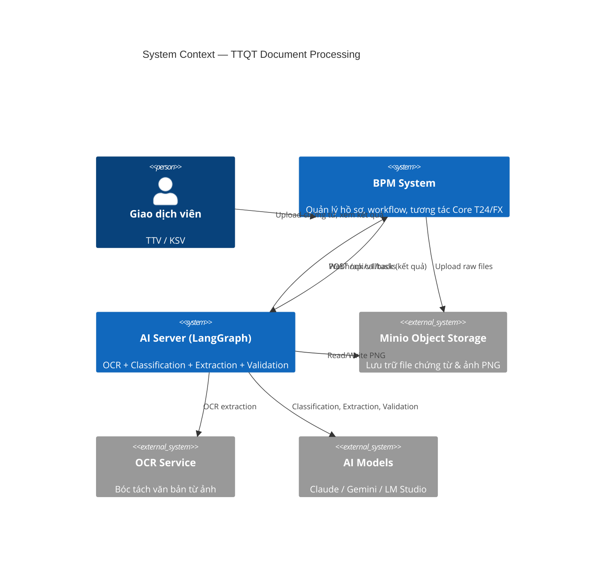
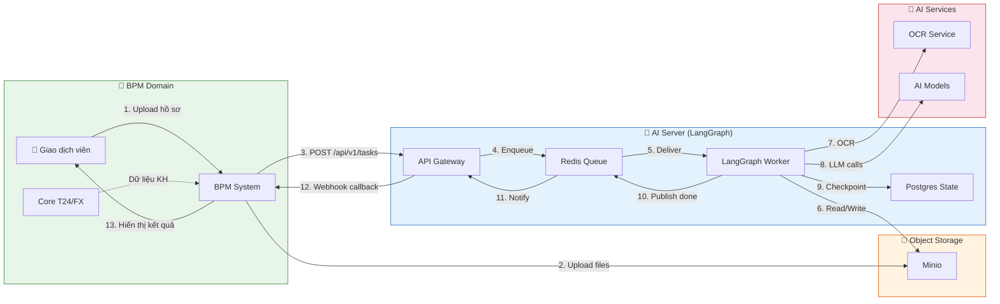
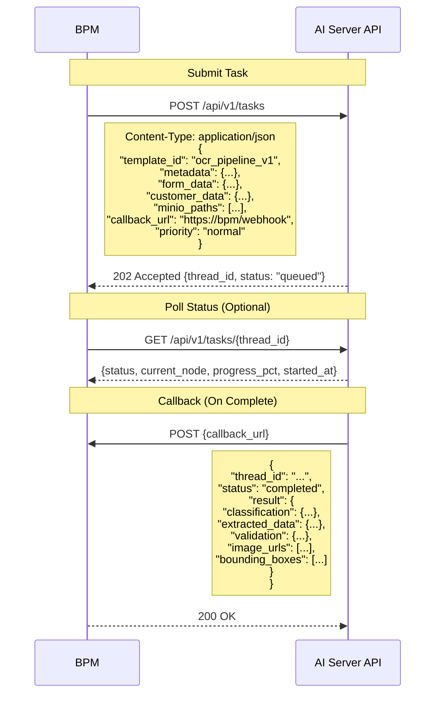
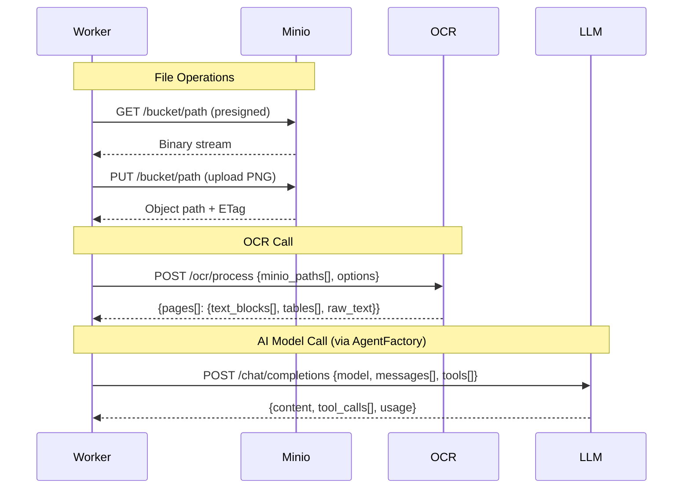
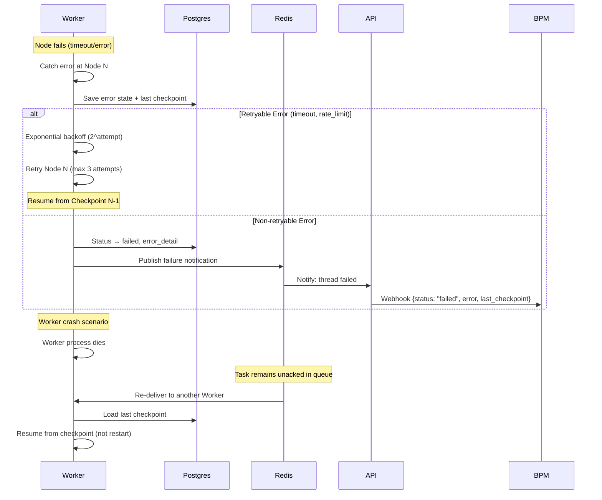
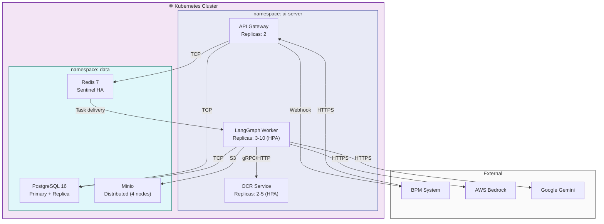

# TTQT Architecture — Xử Lý Hồ Sơ Chứng Từ Ngân Hàng

## 1. System Context (C4 Level 1)



---

## 2. Integration Overview



---

## 3. Sequence Diagram — Full Pipeline

```mermaid
sequenceDiagram
    autonumber
    actor User as Giao dịch viên (TTV/KSV)
    participant BPM as BPM System
    participant Minio as Minio
    box rgba(33,150,243,0.1) AI Server (LangGraph)
        participant API as API Gateway
        participant DB as Postgres
        participant Q as Redis Queue
        participant W as Worker
    end
    participant OCR as OCR Service
    participant LLM as AI Model

    %% ── Phase 1: Initiation ──
    rect rgba(200,230,201,0.3)
        Note over User,Minio: Phase 1 — Khởi tạo hồ sơ
        User->>+BPM: Khởi tạo hồ sơ + upload bộ chứng từ
        BPM->>+Minio: Upload raw files (PDF/DOCX/IMG)
        Minio-->>-BPM: Document paths[]
    end

    %% ── Phase 2: Task Submission ──
    rect rgba(227,242,253,0.3)
        Note over BPM,Q: Phase 2 — Gửi task tới AI Server
        Note right of BPM: Payload JSON:<br/>• metadata (mã GD, loại tiền, số tiền)<br/>• form_data (thông tin KH nhập)<br/>• customer_data (Core T24/FX)<br/>• minio_paths[]<br/>• template_id
        BPM->>+API: POST /api/v1/tasks {payload}
        API->>+DB: Load workflow template
        DB-->>-API: JSON Graph Definition
        API->>DB: Create thread (status: queued)
        API->>+Q: Enqueue task (thread_id, priority)
        Q-->>-API: ACK
        API-->>-BPM: 202 Accepted {thread_id}
        BPM-->>-User: "AI đang xử lý" + tracking ID
    end

    %% ── Phase 3: Graph Execution ──
    rect rgba(252,228,236,0.3)
        Note over Q,LLM: Phase 3 — Graph Execution (5 Nodes)
        Q->>+W: Deliver task (thread_id, config_json)
        Note over W: Graph Compiler:<br/>1. Parse JSON Template → StateGraph<br/>2. Resolve node dependencies & edges<br/>3. Initialize State with payload data
        W->>DB: Update thread status → running
        DB-->>W: OK
    end

    %% ── Phase 3.1: Node 1 — File Conversion ──
    rect rgba(232,245,233,0.3)
        Note over W,Minio: Node 1: file_conversion (type: tool)

        W->>+Minio: GET raw files by minio_paths[]<br/>(PDF: contract.pdf, DOCX: invoice.docx, IMG: bill.jpg)
        Minio-->>-W: Binary file streams (3 files, ~12MB total)

        Note over W: Conversion Engine (per file):<br/>━━━━━━━━━━━━━━━━━━━━━━━━━━━━━━━<br/>• PDF (multi-page) → render each page @ 200 DPI<br/>  └─ contract.pdf (5 pages) → 5× PNG<br/>• DOCX → convert to PDF first → then PNG<br/>  └─ invoice.docx (2 pages) → 2× PNG<br/>• IMG → resize to max 2048px, normalize contrast<br/>  └─ bill.jpg → 1× PNG<br/>━━━━━━━━━━━━━━━━━━━━━━━━━━━━━━━<br/>Total output: 8 PNG files

        W->>+Minio: PUT 8 PNG files → /threads/{id}/pages/
        Minio-->>-W: png_paths[] = [page_001.png ... page_008.png]

        W->>W: State.png_paths = ["threads/abc/pages/page_001.png", ...]
        W->>DB: INSERT checkpoint (node: file_conversion, state_snapshot)
        DB-->>W: checkpoint_id: ckpt_001
    end

    %% ── Phase 3.2: Node 2 — OCR Extraction ──
    rect rgba(227,242,253,0.3)
        Note over W,OCR: Node 2: ocr_extraction (type: tool)

        W->>+OCR: POST /ocr/batch-process
        Note right of W: Request body:<br/>{<br/>  "minio_paths": state.png_paths,<br/>  "options": {<br/>    "model": "lightonocr-2-1b",<br/>    "detect_tables": true,<br/>    "detect_layout": true,<br/>    "languages": ["vi", "en"],<br/>    "output_format": "structured"<br/>  }<br/>}

        Note over OCR: OCR Engine processing (per page):<br/>━━━━━━━━━━━━━━━━━━━━━━━━━━━━━━━<br/>1. Download PNG from Minio (presigned URL)<br/>2. Text Recognition (character detection)<br/>3. Table Detection (cell structure)<br/>4. Layout Analysis (reading order)<br/>5. Confidence scoring per block<br/>━━━━━━━━━━━━━━━━━━━━━━━━━━━━━━━

        OCR-->>-W: Response per page (8 pages):
        Note left of OCR: {<br/>  "pages": [{<br/>    "page_idx": 0,<br/>    "text_blocks": [<br/>      {"text": "HỢP ĐỒNG MUA BÁN", "bbox": [120,45,580,82], "confidence": 0.97},<br/>      {"text": "Số: HD-2024/0381", "bbox": [120,90,400,115], "confidence": 0.99}<br/>    ],<br/>    "tables": [{<br/>      "bbox": [50,200,750,600],<br/>      "cells": [["STT","Mô tả","Số lượng","Đơn giá"],...]<br/>    }],<br/>    "raw_text": "HỢP ĐỒNG MUA BÁN\nSố: HD-2024/0381\n..."<br/>  }, ...]<br/>}

        W->>W: State.ocr_results = pages[] (8 pages, ~45 text blocks total)
        W->>DB: INSERT checkpoint (node: ocr_extraction, state_snapshot)
        DB-->>W: checkpoint_id: ckpt_002
    end

    %% ── Phase 3.3: Node 3 — Classification ──
    rect rgba(255,243,224,0.3)
        Note over W,LLM: Node 3: classification (type: ai, model: claude-haiku)

        Note over W: Prepare classification input:<br/>• Concatenate raw_text from all pages<br/>• Group pages by visual similarity<br/>• Attach classification rules & doc type list

        W->>+LLM: POST /chat/completions (via AgentFactory → Bedrock)
        Note right of W: System prompt:<br/>"Bạn là chuyên gia phân loại chứng từ ngân hàng TTQT.<br/>Phân loại tài liệu sau vào MỘT trong các loại:<br/>• HĐ (Hợp đồng mua bán)<br/>• INV (Invoice / Hóa đơn thương mại)<br/>• TKHQ (Tờ khai hải quan)<br/>• BL (Bill of Lading / Vận đơn)<br/>• CO (Certificate of Origin / C/O)<br/>• GP (Giấy phép xuất nhập khẩu)<br/>• LC (Letter of Credit / Thư tín dụng)<br/>• OTHER"<br/><br/>User message:<br/>"Classify this document:\n{raw_text_concatenated}"

        Note over LLM: AI Processing:<br/>• Analyze document header keywords<br/>• Check structural patterns (table layout, numbering)<br/>• Cross-reference with known templates<br/>• Assign confidence score

        LLM-->>-W: Classification response:
        Note left of LLM: {<br/>  "doc_type": "INV",<br/>  "doc_type_full": "Commercial Invoice",<br/>  "confidence": 0.94,<br/>  "reasoning": "Document contains invoice number,<br/>    seller/buyer info, itemized goods table,<br/>    total amount in USD — matches Invoice pattern",<br/>  "page_assignments": [<br/>    {"pages": [0,1], "type": "INV"},<br/>    {"pages": [2,3,4], "type": "HĐ"},<br/>    {"pages": [5,6,7], "type": "BL"}<br/>  ]<br/>}

        W->>W: State.classification = {doc_type, confidence, page_assignments}
        W->>DB: INSERT checkpoint (node: classification, state_snapshot)
        DB-->>W: checkpoint_id: ckpt_003
    end

    %% ── Phase 3.4: Node 4 — Semantic Extraction ──
    rect rgba(237,231,246,0.3)
        Note over W,LLM: Node 4: semantic_extraction (type: ai, model: claude-sonnet)

        Note over W: Schema Selection (based on classification):<br/>━━━━━━━━━━━━━━━━━━━━━━━━━━━━━━━━━━━━━━━━━━━━━━━<br/>Pages [0,1] → INV schema:<br/>  {invoice_no, date, seller, buyer, currency,<br/>   total_amount, items[], incoterms, payment_terms}<br/><br/>Pages [2,3,4] → HĐ schema:<br/>  {contract_no, date, party_a, party_b, value,<br/>   currency, delivery_date, terms[]}<br/><br/>Pages [5,6,7] → BL schema:<br/>  {bl_no, shipper, consignee, notify_party,<br/>   vessel, port_loading, port_discharge,<br/>   goods_description, container_no}<br/>━━━━━━━━━━━━━━━━━━━━━━━━━━━━━━━━━━━━━━━━━━━━━━━

        W->>+LLM: POST /chat/completions (claude-sonnet, per doc group)
        Note right of W: System prompt:<br/>"Extract fields from this Invoice document.<br/>Return JSON matching this schema exactly.<br/>Include bbox coordinates for each field.<br/>If a field is not found, set value to null."<br/><br/>Few-shot examples: [2 examples of INV extraction]<br/><br/>User message:<br/>"OCR text:\n{pages[0,1].raw_text}\n\nBounding boxes:\n{pages[0,1].text_blocks}"

        Note over LLM: Extraction processing:<br/>• Map text blocks to schema fields<br/>• Parse amounts (handle , vs . decimal)<br/>• Normalize dates (DD/MM/YYYY → ISO)<br/>• Resolve entity names (fuzzy match)<br/>• Calculate per-field confidence

        LLM-->>-W: Extracted fields (per document):
        Note left of LLM: {<br/>  "documents": [{<br/>    "doc_type": "INV",<br/>    "pages": [0, 1],<br/>    "structured_data": {<br/>      "invoice_no": "INV-2024-00847",<br/>      "date": "2024-03-15",<br/>      "seller": "ABC Trading Co., Ltd",<br/>      "buyer": "XYZ Import JSC",<br/>      "currency": "USD",<br/>      "total_amount": 125000.00,<br/>      "items": [<br/>        {"desc": "Steel plates 10mm", "qty": 500, "unit_price": 250.00}<br/>      ],<br/>      "incoterms": "CIF Ho Chi Minh",<br/>      "payment_terms": "L/C at sight"<br/>    },<br/>    "field_bbox": {<br/>      "invoice_no": [320, 90, 580, 115],<br/>      "total_amount": [500, 450, 720, 480]<br/>    },<br/>    "field_confidence": {<br/>      "invoice_no": 0.99,<br/>      "total_amount": 0.97,<br/>      "seller": 0.92<br/>    }<br/>  }, ...]<br/>}

        W->>W: State.extracted_data = documents[] (3 docs, ~35 fields total)
        W->>DB: INSERT checkpoint (node: semantic_extraction, state_snapshot)
        DB-->>W: checkpoint_id: ckpt_004
    end

    %% ── Phase 3.5: Node 5 — Cross Validation ──
    rect rgba(255,235,238,0.3)
        Note over W,LLM: Node 5: cross_validation (type: ai, model: claude-haiku)

        Note over W: Prepare 3-source comparison matrix:<br/>━━━━━━━━━━━━━━━━━━━━━━━━━━━━━━━━━━━━━━━━━━━━━━━<br/>Source A — BPM Form (GDV nhập):<br/>  {amount: 125000, currency: "USD", beneficiary: "ABC Trading"}<br/><br/>Source B — OCR Extracted (AI trích xuất):<br/>  {total_amount: 125000.00, currency: "USD", seller: "ABC Trading Co., Ltd"}<br/><br/>Source C — Core T24/FX (Hệ thống ngân hàng):<br/>  {customer_name: "XYZ Import JSC", limit: 500000, currency: "USD"}<br/>━━━━━━━━━━━━━━━━━━━━━━━━━━━━━━━━━━━━━━━━━━━━━━━<br/><br/>Validation Rules:<br/>• R1: amount_A == amount_B (exact match)<br/>• R2: currency_A == currency_B == currency_C<br/>• R3: amount_A <= limit_C (within approval limit)<br/>• R4: beneficiary_A ≈ seller_B (fuzzy, threshold 85%)<br/>• R5: buyer_B == customer_name_C (fuzzy)<br/>• R6: Fraud check — amount vs historical average

        W->>+LLM: POST /chat/completions (validation prompt)
        Note right of W: System prompt:<br/>"You are a banking compliance validator.<br/>Compare data from 3 sources and flag discrepancies.<br/>Apply these rules: {R1..R6}<br/>For fuzzy matches, use threshold 85%.<br/>Flag anything suspicious for fraud review."<br/><br/>Input:<br/>{source_a: {...}, source_b: {...}, source_c: {...},<br/> rules: [...], historical_avg: 80000}

        Note over LLM: Validation Engine:<br/>• R1: 125000 == 125000.00 ✅ MATCH<br/>• R2: USD == USD == USD ✅ MATCH<br/>• R3: 125000 <= 500000 ✅ WITHIN LIMIT<br/>• R4: "ABC Trading" ≈ "ABC Trading Co., Ltd" → 89% ✅ MATCH<br/>• R5: "XYZ Import JSC" == "XYZ Import JSC" → 100% ✅ MATCH<br/>• R6: 125000 vs avg 80000 → 56% above avg ⚠️ WARNING

        LLM-->>-W: Validation result:
        Note left of LLM: {<br/>  "overall_status": "warning",<br/>  "total_fields_checked": 12,<br/>  "results": {<br/>    "match": 8,<br/>    "mismatch": 1,<br/>    "warning": 2,<br/>    "fraud_suspect": 1<br/>  },<br/>  "field_results": [<br/>    {"field": "amount", "status": "match", "rule": "R1",<br/>     "source_a": 125000, "source_b": 125000.00},<br/>    {"field": "amount_vs_limit", "status": "warning", "rule": "R6",<br/>     "detail": "56% above historical average",<br/>     "recommendation": "KSV review required"},<br/>    {"field": "delivery_date", "status": "mismatch", "rule": "R1",<br/>     "source_a": "2024-04-01", "source_b": "2024-04-15",<br/>     "bbox": [400, 320, 580, 345]}<br/>  ],<br/>  "fraud_flags": [<br/>    {"type": "amount_anomaly", "severity": "low",<br/>     "detail": "Transaction 56% above 6-month average"}<br/>  ]<br/>}

        Note over W: Post-processing:<br/>• Crop error regions from PNG using bbox<br/>• delivery_date mismatch → crop page_3[400,320,580,345]<br/>• Generate comparison overlay image

        W->>+Minio: PUT error crops → /threads/{id}/errors/
        Note right of W: Files uploaded:<br/>• error_delivery_date.png (cropped region)<br/>• overlay_page_3.png (full page + red highlight)
        Minio-->>-W: Signed URLs (expires: 24h):<br/>• https://minio/threads/abc/errors/error_delivery_date.png?sig=...<br/>• https://minio/threads/abc/errors/overlay_page_3.png?sig=...

        W->>W: State.validation_result = {overall, field_results[], error_urls[]}
        W->>DB: INSERT checkpoint (node: cross_validation, state_snapshot — FINAL)
        DB-->>W: checkpoint_id: ckpt_005
    end

    %% ── Phase 4: Completion & Callback ──
    rect rgba(255,243,224,0.3)
        Note over W,User: Phase 4 — Hoàn thành & Trả kết quả
        W->>DB: Status → completed
        W->>Q: Publish result (Pub/Sub)
        deactivate W
        Q->>+API: Notify completion
        API->>+DB: Load final state
        DB-->>-API: Full result (all nodes)
        Note right of API: Callback payload:<br/>• PNG signed URLs<br/>• Bounding boxes<br/>• Classification result<br/>• Extracted fields + bbox<br/>• Validation results<br/>• Error image URLs
        API->>+BPM: Webhook POST {results}
        deactivate API
        Note right of BPM: UI update:<br/>• Overlay bbox on PNG<br/>• Highlight: 🟢match 🟡warning 🔴mismatch<br/>• Show extracted data<br/>• Tooltip error images
        BPM->>User: Hiển thị kết quả đối soát
        deactivate BPM
    end
```



---

## 4. Node Pipeline Detail

```mermaid
stateDiagram-v2
    direction LR

    [*] --> file_conversion
    file_conversion --> ocr_extraction
    ocr_extraction --> classification
    classification --> semantic_extraction
    semantic_extraction --> cross_validation
    cross_validation --> [*]

    state file_conversion {
        direction LR
        [*] --> DownloadRaw
        DownloadRaw --> ConvertPNG
        ConvertPNG --> UploadPNG
        UploadPNG --> [*]
    }

    state ocr_extraction {
        direction LR
        [*] --> SendToOCR
        SendToOCR --> ParseResult
        ParseResult --> [*]
    }

    state classification {
        direction LR
        [*] --> PromptLLM_Classify
        PromptLLM_Classify --> ParseDocType
        ParseDocType --> [*]
    }

    state semantic_extraction {
        direction LR
        [*] --> SelectSchema
        SelectSchema --> PromptLLM_Extract
        PromptLLM_Extract --> MapFields
        MapFields --> [*]
    }

    state cross_validation {
        direction LR
        [*] --> CompareSourcesABC
        CompareSourcesABC --> PromptLLM_Validate
        PromptLLM_Validate --> CropErrors
        CropErrors --> [*]
    }
```



---

## 5. API Contract (Integration Points)

### 5.1 BPM → AI Server



### 5.2 Worker → External Services



---

## 6. Error Handling & Recovery



---

## 7. Data Flow Summary

| Phase | From | To | Protocol | Payload |
|-------|------|----|----------|---------|
| Upload | BPM | Minio | S3 API | Raw files (PDF/DOCX/IMG) |
| Submit | BPM | API Gateway | HTTP POST | JSON: metadata + paths + template_id |
| Enqueue | API | Redis | XADD (Stream) | thread_id + config + priority |
| Execute | Worker | Minio | S3 GET/PUT | PNG files |
| OCR | Worker | OCR Service | HTTP POST | PNG paths → text + bbox |
| Classify | Worker | LLM | HTTP POST | text → doc_type |
| Extract | Worker | LLM | HTTP POST | text + schema → structured data |
| Validate | Worker | LLM | HTTP POST | sources A,B,C → match results |
| Notify | Worker | Redis | PUBLISH | thread_id completed |
| Callback | API | BPM | HTTP POST (Webhook) | Full result JSON |

---

## 8. JSON Workflow Template

```json
{
  "template_id": "ocr_pipeline_v1",
  "name": "OCR + Classification + Extraction + Validation",
  "version": "1.0.0",
  "nodes": [
    {
      "id": "file_conversion",
      "type": "tool",
      "config": {
        "action": "convert_to_png",
        "dpi": 200,
        "source": "state.minio_paths"
      },
      "next": "ocr_extraction"
    },
    {
      "id": "ocr_extraction",
      "type": "tool",
      "config": {
        "action": "ocr_process",
        "model": "lightonocr-2-1b",
        "source": "state.png_paths"
      },
      "next": "classification"
    },
    {
      "id": "classification",
      "type": "ai",
      "config": {
        "model": "claude-haiku",
        "provider": "bedrock",
        "prompt_template": "classify_document_v2",
        "input": "state.ocr_results[].raw_text"
      },
      "next": "semantic_extraction"
    },
    {
      "id": "semantic_extraction",
      "type": "ai",
      "config": {
        "model": "claude-sonnet",
        "provider": "bedrock",
        "prompt_template": "extract_fields_v2",
        "schema_source": "state.classification.doc_type",
        "input": "state.ocr_results[].raw_text"
      },
      "next": "cross_validation"
    },
    {
      "id": "cross_validation",
      "type": "ai",
      "config": {
        "model": "claude-haiku",
        "provider": "bedrock",
        "prompt_template": "validate_fields_v1",
        "sources": [
          "state.extracted_data",
          "state.bpm_form_data",
          "state.customer_data"
        ]
      },
      "next": "__end__"
    }
  ],
  "retry_policy": {
    "max_retries": 3,
    "backoff_base": 2.0,
    "retry_on": ["timeout", "rate_limit", "server_error"]
  },
  "callback": {
    "url": "{{bpm_callback_url}}",
    "method": "POST",
    "headers": {
      "Authorization": "Bearer {{bpm_token}}"
    }
  }
}
```

---

## 9. Deployment Topology



---

## 10. Key Architecture Decisions

| Decision | Choice | Rationale |
|----------|--------|-----------|
| Async processing | Redis Queue + Webhook callback | OCR pipeline takes 10-60s, BPM shouldn't block |
| State management | Postgres checkpoints per node | Resume from failure, audit trail, observability |
| Graph definition | JSON Template (not code) | Change workflow without redeployment |
| OCR service | Separate microservice | Scale independently, stateless |
| AI routing | AgentFactory pattern | Multi-provider (Bedrock, Gemini, LM Studio) |
| File storage | Minio (S3-compatible) | On-prem, presigned URLs, lifecycle policies |
| Worker scaling | HPA on queue depth | Auto-scale based on pending tasks |
| Error recovery | Checkpoint + re-deliver | No work lost on crash |

---

## 11. Glossary

| Term | Description |
|------|-------------|
| **Thread** | A single execution instance of a workflow template |
| **Checkpoint** | Serialized state snapshot saved after each node completes |
| **StateGraph** | Compiled graph object from JSON template (LangGraph concept) |
| **Node** | A single processing step in the pipeline |
| **Template** | JSON definition of the graph structure and node configurations |
| **Callback** | Webhook POST from AI Server back to BPM on completion |
| **TTV** | Teller (Giao dịch viên) |
| **KSV** | Supervisor (Kiểm soát viên) |
| **TKHQ** | Tờ khai hải quan (Customs declaration) |
| **B/L** | Bill of Lading |
| **C/O** | Certificate of Origin |
